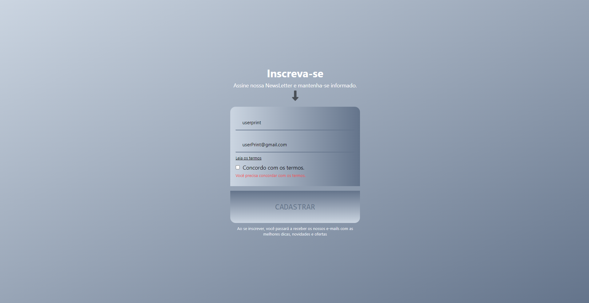
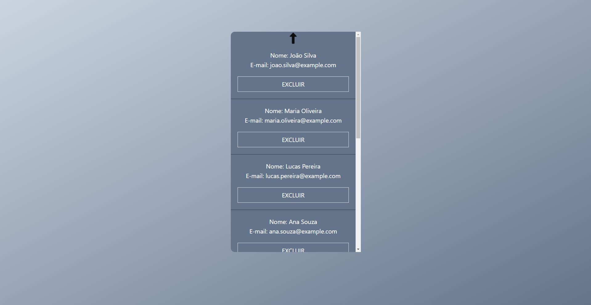

# Newsletter Form

Este é um formulário de cadastro de usuários construído com TypeScript, React.js e estilizado utilizando Tailwind CSS.

*Tela de cadastro do formulário.*

*Visualização de todos os registros cadastrados.*

## Funcionalidades

- Os usuários devem preencher todos os campos do formulário, incluindo a marcação da opção de aceitação dos termos.
- A validação é aplicada para garantir que todos os campos sejam preenchidos. Se algum campo não for preenchido, o usuário receberá um alerta.
- Os dados são salvos e exibidos utilizando a biblioteca json-server para simular uma API. Essa abordagem é ideal para projetos de estudo, proporcionando uma simulação realista sem a necessidade de uma API completa.
- Além do cadastro, os usuários podem visualizar todos os registros e têm a opção de excluí-los.

